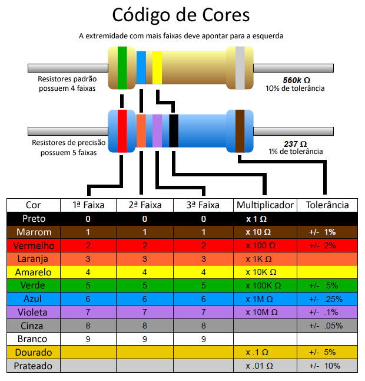

import Tabs from '@theme/Tabs';
import TabItem from '@theme/TabItem';

# Medições usando multimetro

## 🛠 Requisitos e Materiais

1. [Multímetro Digital](https://hikari.nyc3.cdn.digitaloceanspaces.com/g9uqm4gdc6luf08b8pnjw1el9mxm)
2. Resistores de $1K\Omega$, $10K\Omega$, $47K\Omega$ e $1M\Omega$
3. Capacitores de $10\mu F, $ $47\mu F$ e $1\mu F$.
4. Jumpers

## 📝 Lista de Exercícios

### Exercício 1: Medindo Resistência com Multímetro

**Objetivo:** Utilizando o multímetro, meça os valores dos resistores de $10\mathrm{k}\Omega$, $47\mathrm{k}\Omega$ e $1\mathrm{M}\Omega$.

:::tip
Utilize a tabela de código de resistores para descobrir o valor do resistor previamente.

:::

💡 Solução 

Os valores medidos devem ser próximos dos valores teóricos e estar dentro da faixa de tolerância dos resistores.

---

### Exercício 2: Medindo Capacitância com Multímetro

**Objetivo:** Utilizando o multímetro, meça os valores dos Capacitores de $10\mu F, $ $47\mu F$ e $1\mu F$.

💡 Solução 

Os valores medidos devem ser próximos dos valores teóricos e estar dentro da faixa de tolerância dos capacitores.

---

### Exercício 3: Medindo Tensão Contínua (V_CC)

**Objetivo:** Medir a tensão contínua de uma pilha ou fonte e identificar a polaridade.

💡 Solução 

A leitura deve ter o valor nominal da fonte. Uma indicação negativa significa que as pontas foram invertidas.

---

### Exercício 4: Medindo Tensão Alternada (V_CA)

**Objetivo:** Medir a tensão alternada da tomada comparar a leitura com o valor esperado.

:::tip
Não faça medições em tomadas ou na rede elétrica sem supervisão e sem um multímetro adequado à categoria de segurança do circuito.
:::

💡 Solução 

A leitura deve ser próxima do valor eficaz informado pela fonte.

---

### Exercício 5: Testando Diodos

**Objetivo:** Verificar se um diodo está diretamente polarizado ou inversamente e identificar a queda de tensão direta de um diodo.

:::tip
Desligue o circuito antes de usar continuidade ou teste de diodo. Nunca aplique essas funções em um circuito energizado.
:::

💡 Solução 

No teste de diodo, a leitura deve aparecer em apenas um sentido caso inverta as pontas, o multímetro deve indicar circuito aberto ou uma leitura fora da faixa.

---

### Exercício 6: Testando continuidade

**Objetivo:** Verificar através da continuidade se há um curto ou não.

💡 Solução 

Na função de continuidade, o aviso sonoro deve ocorrer em um condutor com baixa resistência.

---

### Exercício 7: Medindo Corrente Contínua (A_CC)

**Objetivo:** Medir a corrente consumida por uma carga de de $10K\Omega$ à uma tensão de 5V utilizando um multímetro .

:::tip
Antes de ligar o circuito, conecte a ponta vermelha à entrada correta de corrente, abra o circuito para inserir o multímetro em série. Nunca meça corrente colocando as pontas diretamente em paralelo com a fonte.
:::

💡 Solução 

Pela Lei de Ohm, a corrente esperada é $I = V/R = 5\mathrm{V}/1\mathrm{k}\Omega = 5\mathrm{mA}$. 
A medição deve estar próxima do valor calculado.

